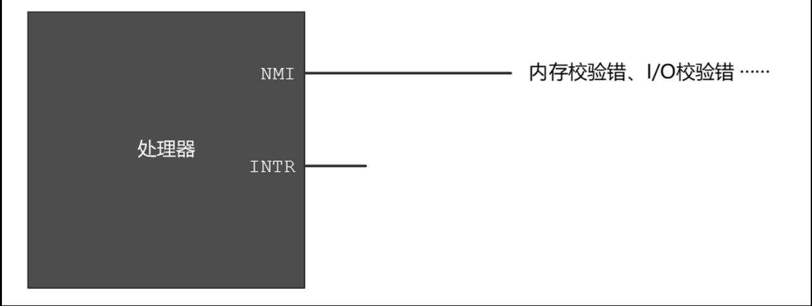

# 外部硬件中断
顾名思义，外部硬件中断，就是从处理器外面来的中断信号。当外部设备发生错误，或者有数据要传送（比如，从网络中接收到一个针对当前主机的数据包），或者处理器交给它的事情处理完了（比如，打印已经完成），又或者一个定时器到达指定的时间间隔时，它们都会拍一下处理器的肩膀，告诉它应当先把手头上的事情放一放，来临时处理一下。

如图所示，外部硬件中断是通过两个信号线引入处理器内部的。从很早的时候起，也就是8086处理器的时代，这两根线的名字就叫NMI和INTR。
